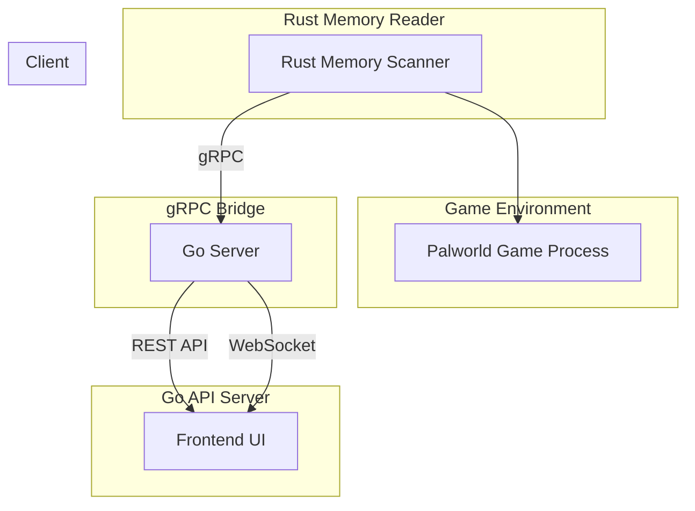

# PalBaseIQ

A Palworld Base Optimization & Pathing Visualizer

A application designed to introspect live memory from the game **Palworld** to optimize base layouts and resolve pathing inefficiencies in real time.

---

## 🧩 Problem Statement

Palworld players often struggle with inefficient base layouts, NPC (Pal) pathing issues, and poor resource flow. The game lacks tooling to:

- Visualize and understand Pal movement behavior
- Diagnose workstation and object placement bottlenecks
- Optimize base layout for productivity and traversal

These inefficiencies reduce overall base performance and user experience.

---

## 🧠 Solution Overview

This project enables **real-time visibility** into your Palworld base and NPC behaviors by:

1. Reading and decoding live game memory
2. Mapping Pal and object positions in a structured format
3. Serving this data via a clean API layer
4. Visualizing everything through a web interface

---

## 🛠️ Architecture

⸻

📦 Components

🦀 Rust Memory Reader
	•	Reads memory from Palworld using process_vm_readv or ptrace
	•	Decodes object and entity data into usable structures
	•	Exposes structured data via gRPC

🐹 Go API Server
	•	Bridges gRPC data from Rust into REST and WebSocket endpoints
	•	Handles client communication and frontend integration
	•	Performs lightweight data transformation and caching

💻 Frontend UI
	•	Provides a live visual map of the base
	•	Highlights Pal paths, workstation usage, and spatial relationships
	•	Offers optimization suggestions based on collected data

⸻

✨ Features (Planned)
	•	📍 Real-time Pal and object position tracking
	•	🧠 Pathing bottleneck detection and reroute suggestions
	•	📐 Base layout heatmaps and workstation efficiency scores
	•	💬 WebSocket updates for live UI syncing
	•	📊 Historical tracking of base performance

⸻

🚀 Getting Started

⚠️ Requires root privileges or appropriate capabilities on Linux

	1.	Launch Palworld
	2.	Run the Rust scanner binary with target PID
	3.	Start the Go API server
	4.	Open the frontend in your browser

⸻

📚 License

MIT License. Built for educational and personal use. Please respect the game’s terms of service and do not use this in multiplayer environments.

⸻

🤝 Contributing

This project is in early development. If you’re interested in contributing to memory mapping, optimization logic, or UI design, feel free to open an issue or PR.

⸻

## Directory Layout
PalBaseIQ/
├── README.md
├── .gitignore
├── go-api/                         # Go server (API + gRPC client)
│   ├── cmd/
│   │   └── server/                 # Entrypoint: main.go
│   ├── internal/
│   │   ├── grpcclient/            # gRPC client code for talking to Rust
│   │   ├── handlers/              # HTTP/WebSocket route handlers
│   │   └── models/                # Shared data structs
│   ├── proto/                     # Protobuf-generated Go code (from shared proto)
│   ├── go.mod
│   └── go.sum
│
├── rust-scanner/                  # Rust binary to read Palworld memory
│   ├── src/
│   │   ├── main.rs
│   │   ├── memory/                # Memory parsing logic
│   │   ├── process/               # PID + memory region discovery
│   │   └── grpc_server.rs         # Exposes game data via gRPC
│   ├── build.rs
│   ├── Cargo.toml
│   └── proto/                     # Protobuf definitions used in gRPC
│
├── frontend/                      # Web frontend (React, Vue, etc.)
│   ├── public/
│   ├── src/
│   │   ├── components/
│   │   ├── pages/
│   │   ├── services/              # Calls Go API via REST/WebSocket
│   │   └── types/
│   ├── vite.config.ts             # (or next.config.js / etc.)
│   ├── tsconfig.json
│   └── package.json
│
├── shared-proto/                  # Shared protobuf schema (used by Rust + Go)
│   └── palworld.proto
│
├── scripts/                       # Dev and deploy scripts
│   ├── build.sh
│   ├── dev.sh
│   └── run_all.sh
│
└── docker/                        # (optional) container setup
    ├── Dockerfile.rust
    ├── Dockerfile.go
    └── docker-compose.yml
